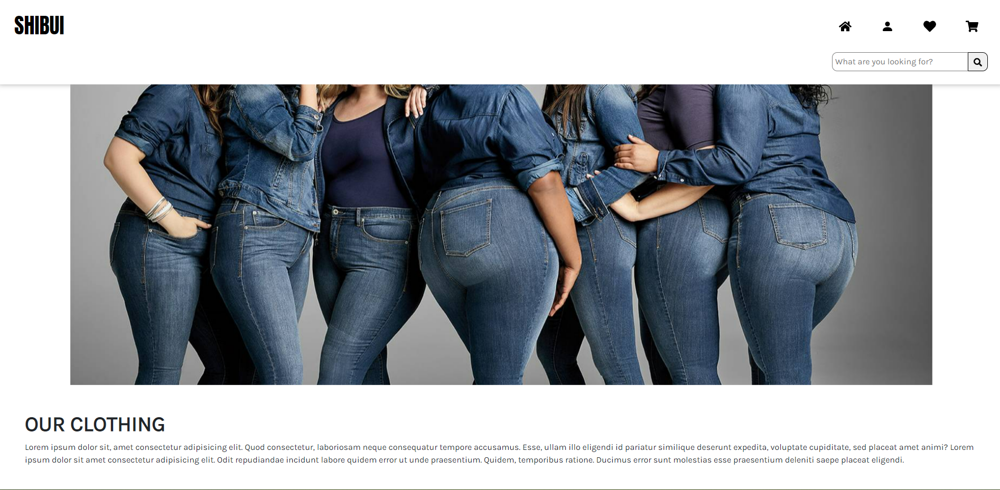

## Shibui: E-commerce Website

### Outline

This goal of this project is to reinforce and further develop my skills and understanding of React. The aim is to create an e-commerce website using the following:

-   Fetch data with React
-   React-router-dom
-   Firebase/Firestore

### Criteria

Three Pages:

1.  Home Page
    -   [x] Product grid
    -   [x] Carousel of featured products
2.  Product page where

    -   [x] add the item to cart
    -   [x] select product variants
    -   [x] displays product information (see line 30)

3.  Create a cart system
    -   [x] list of items
    -   [x] add/remove items from cart
    -   [x] edit qty
    -   [x] prevent users from adding items that are no longer in stock

Firestore should store the following information about the products:

-   qty
-   variants
-   price
-   name
-   image url
-   saved or not

Notes:

-   All data should be stored in Firestore and fetched by frontend.
-   There should be NO static product data

### Screenshots

<!-- NOTE: add screenshots of final product here to showcase the work. If people want to see the working project they will likely get in contact -->

### Mindmap

Inspiration: Dangerfield, Cotton:On, Muji, H&M, Uniqlo

### Known Issues

-   Cart data is not persistent - user will lose the cart if they refresh the page.
